# Agent Interaction Flows

**Visual diagrams showing how agents collaborate for different user scenarios**

## Quick Navigation

### Core User Flows

**Vocabulary Teaching:**
- [Flow 1A: Vocabulary Teaching - Batch Introduction](#flow-1a-vocabulary-teaching---batch-introduction)
- [Flow 1B: Vocabulary Teaching - Batch Quiz](#flow-1b-vocabulary-teaching---batch-quiz)
- [Flow 1C: Vocabulary Teaching - Final Test](#flow-1c-vocabulary-teaching---final-test)

**Grammar Teaching:**
- [Flow 2A: Grammar Teaching - Topic Explanation](#flow-2a-grammar-teaching---topic-explanation)
- [Flow 2B: Grammar Teaching - Topic Quiz (5 Questions)](#flow-2b-grammar-teaching---topic-quiz-5-questions)

**Other Flows:**
- [Flow 3: Exercise Mode (Generate + Complete)](#flow-3-exercise-mode-generate--complete)
- [Flow 4: Test Mode (Multiple Grammar Points)](#flow-4-test-mode-multiple-grammar-points)
- [Flow 5: Adding New Lesson (No Retrain)](#flow-5-adding-new-lesson-no-retrain)

### Error Handling
- [Error Case 1: RAG Returns No Results](#error-case-1-rag-returns-no-results)
- [Error Case 2: Agent 2 Returns Invalid JSON](#error-case-2-agent-2-returns-invalid-json)
- [Error Case 3: Agent 3 Generation Timeout](#error-case-3-agent-3-generation-timeout)

### Technical Details
- [State Management](#state-management)
- [Performance Considerations](#performance-considerations)
- [Flow Patterns Summary](#summary-flow-patterns)

---

## Overview: Agent Communication Pattern

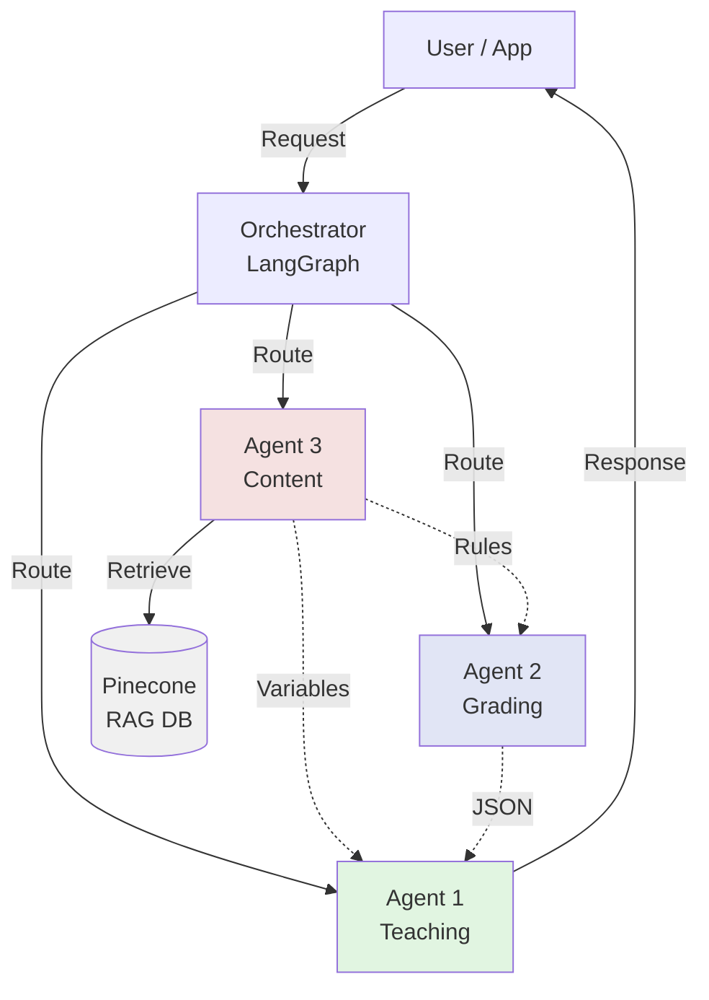

**Key Pattern:**
- User always talks to Orchestrator
- Orchestrator routes to appropriate flow
- Agent 3 provides data to Agent 1 and Agent 2
- Agent 1 always formats final user-facing response

---

## Flow 1A: Vocabulary Teaching - Batch Introduction

**Scenario:** User starts Lesson 3 vocabulary learning (10 words, 3 batches)

### Sequence Diagram

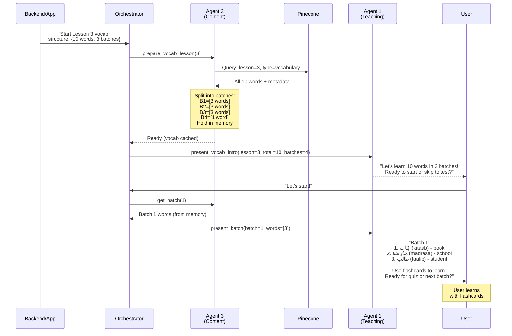

### Step-by-Step

1. **Backend → Orchestrator:** 
   - "Start Lesson 3 vocabulary"
   - Provides structure: `{lesson: 3, type: "vocabulary", total_words: 10, batches: 4}`

2. **Agent 3 Preparation:**
   - Queries Pinecone for all Lesson 3 vocabulary
   - Retrieves 10 words with metadata (Arabic, transliteration, English)
   - Splits into batches: [3, 3, 3, 1]
   - **Holds ALL batches in memory** (no more RAG queries needed)

3. **Agent 1 Introduction:**
   - Presents vocabulary overview
   - "Let's learn 10 words in 3 batches!"
   - Offers: start or skip to test

4. **User Chooses:** "Let's start!"

5. **Agent 3 → Agent 1:**
   - Agent 3 provides Batch 1 words (from memory, instant)
   - Agent 1 formats with Arabic, transliteration, English

6. **User Receives:**
   ```
   "Batch 1:
   1. كِتَاب (kitaab) - book
   2. مَدْرَسَة (madrasa) - school
   3. طَالِب (taalib) - student
   
   Use the flashcards to learn them.
   When ready: 'quiz me' or 'next batch'"
   ```

7. **User Learns** (with flashcard tool, outside system)

**State After Flow:**
- ✅ Agent 3 has all 10 words cached in memory
- ✅ User presented Batch 1
- ✅ System ready for: batch quiz, next batch, or skip to test

**User Options:**
- "quiz me on batch 1" → [Flow 1B](#flow-1b-vocabulary-teaching---batch-quiz)
- "next batch" → Repeat with Batch 2
- "skip to test" → [Flow 1C](#flow-1c-vocabulary-teaching---final-test)

---

## Flow 1B: Vocabulary Teaching - Batch Quiz

**Scenario:** User requests quiz on the 3 words from Batch 1

### Sequence Diagram

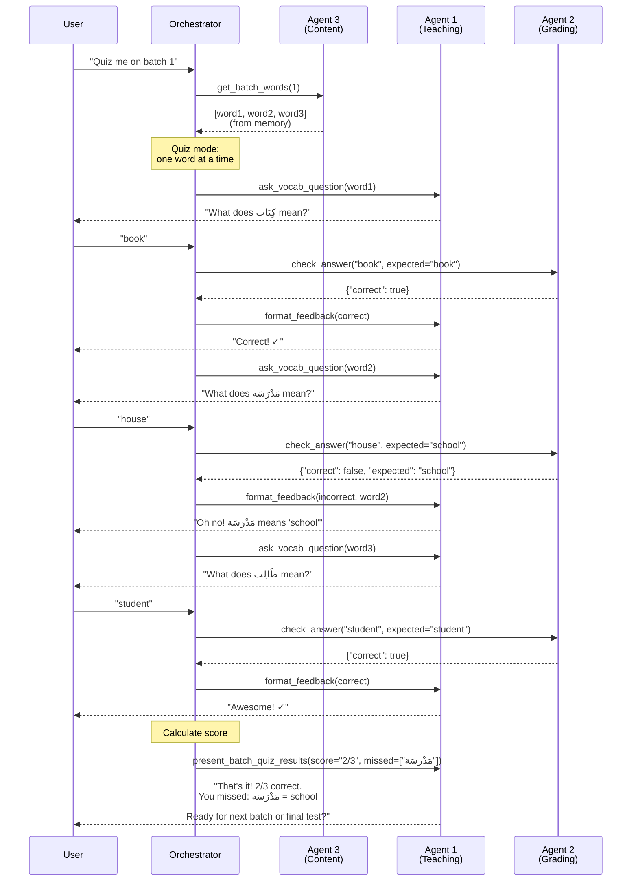

### Step-by-Step

1. **User → Orchestrator:** "Quiz me on batch 1"

2. **Agent 3:** Provides batch 1 words from memory (instant)

3. **Quiz Loop** (one word at a time):
   
   **Question 1:**
   - Agent 1: "What does كِتَاب mean?"
   - User: "book"
   - Agent 2: Grades → correct
   - Agent 1: "Correct! ✓"
   
   **Question 2:**
   - Agent 1: "What does مَدْرَسَة mean?"
   - User: "house"
   - Agent 2: Grades → incorrect (expected: "school")
   - Agent 1: "Oh no! مَدْرَسَة actually means 'school'"
   
   **Question 3:**
   - Agent 1: "What does طَالِب mean?"
   - User: "student"
   - Agent 2: Grades → correct
   - Agent 1: "Awesome! ✓"

4. **Agent 1 Summary:**
   ```
   "That's it for the short quiz! You got 2/3 correct.
   
   You missed: مَدْرَسَة (madrasa) = school
   
   Ready for the next batch? You can also skip to the final test."
   ```

**State After Flow:**
- ✅ Batch 1 quiz completed (2/3 score recorded)
- ✅ User knows what was missed
- ✅ Ready for: next batch or final test

**User Options:**
- "next batch" → Present Batch 2 (Flow 1A repeated)
- "skip to final test" → [Flow 1C](#flow-1c-vocabulary-teaching---final-test)

---

## Flow 1C: Vocabulary Teaching - Final Test

**Scenario:** User completes all batches and takes final test on all 10 words

### Sequence Diagram

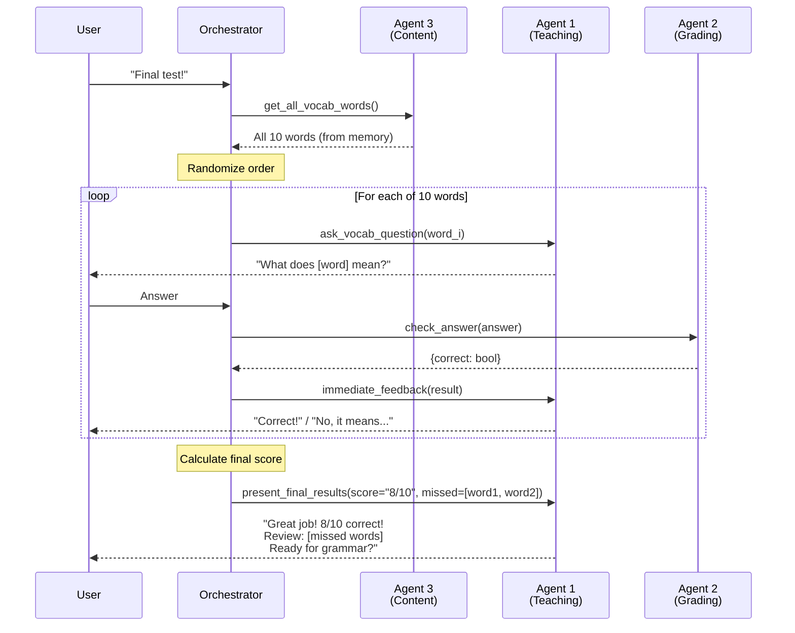

### Step-by-Step

1. **User → Orchestrator:** "I'm ready for the final test"

2. **Agent 3:** Provides all 10 words from memory

3. **Orchestrator:** Randomizes word order

4. **Test Loop** (10 questions, one at a time with immediate feedback)

5. **Agent 1 Final Results:**
   ```
   "Excellent work! You scored 8 out of 10! 🎉
   
   Review these words:
   - مَدْرَسَة (madrasa) = school
   - قَلَم (qalam) = pen
   
   You're ready to move on to grammar!"
   ```

**State After Flow:**
- ✅ Vocabulary phase complete (8/10 score)
- ✅ User knows which words to review
- ✅ System transitions to grammar teaching

---

## Flow 2A: Grammar Teaching - Topic Explanation

**Scenario:** User starts grammar learning for Lesson 3 (2 topics: feminine nouns, definite article)

### Sequence Diagram

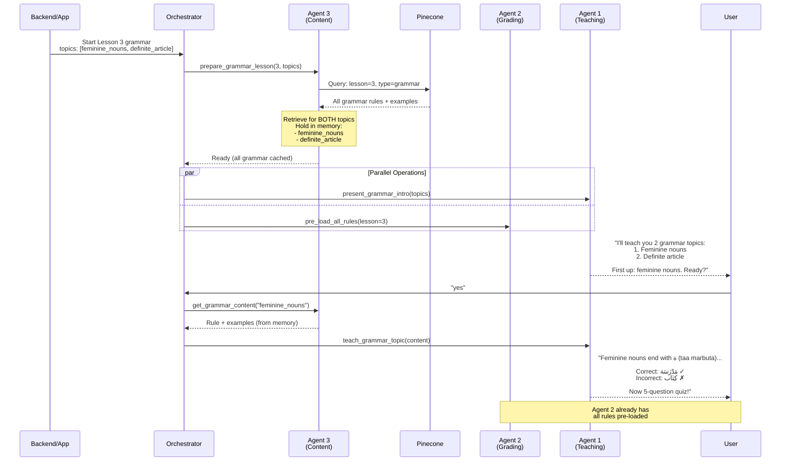

### Step-by-Step

1. **Backend → Orchestrator:**
   - "Start Lesson 3 grammar"
   - Provides topics: `["feminine_nouns", "definite_article"]`

2. **Agent 3 Preparation:**
   - Retrieves ALL grammar content for Lesson 3 from Pinecone
   - Gets rules, examples, detection patterns for BOTH topics
   - **Holds everything in memory**

3. **Parallel Operations:**
   - Agent 1: Presents grammar overview
   - Agent 2: Pre-loads all grammar rules for quizzing

4. **Agent 1 Introduction:**
   ```
   "I'll be teaching you some grammar for Lesson 3:
   1. Feminine nouns
   2. Definite article (ال)
   
   First up: feminine nouns. Ready to start?"
   ```

5. **User:** "yes"

6. **Agent 3 → Agent 1:**
   - Provides feminine_nouns content from memory
   - Rule + correct/incorrect examples

7. **Agent 1 Teaching:**
   ```
   "In Arabic, feminine nouns usually end with ة (taa marbuta).
   
   **The Rule:**
   Words ending in ة are feminine (with some exceptions)
   
   **Examples - Correct:**
   - مَدْرَسَة (madrasa) - school ✓ (feminine)
   - طَاوِلَة (taawila) - table ✓ (feminine)
   
   **Examples - Incorrect:**
   - كِتَاب (kitaab) - book ✗ (masculine, no ة)
   
   Now let's test your understanding with a short 5-question exercise!"
   ```

8. **System Transitions** to [Flow 2B](#flow-2b-grammar-teaching---topic-quiz-5-questions)

**State After Flow:**
- ✅ Agent 3 has both grammar topics in memory
- ✅ Agent 2 has all rules pre-loaded
- ✅ User learned Topic 1 explanation
- ✅ Ready for Topic 1 quiz

---

## Flow 2B: Grammar Teaching - Topic Quiz (5 Questions)

**Scenario:** User takes 5-question quiz on "feminine nouns" topic

### Sequence Diagram

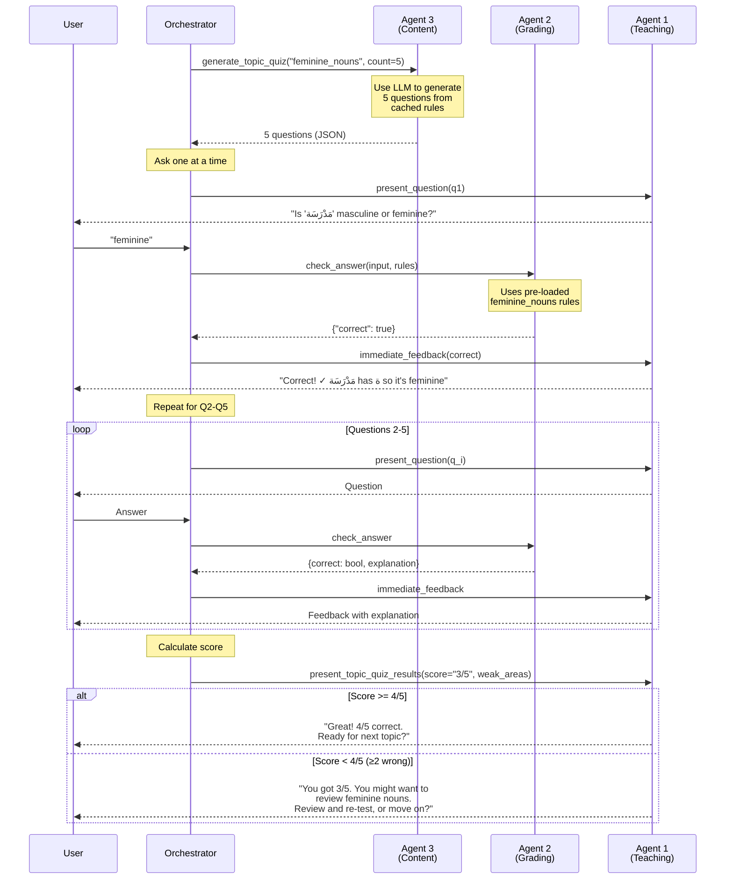

### Step-by-Step

1. **Agent 3:** Generates 5 questions using LLM + cached rules

2. **Quiz Loop** (5 questions, one at a time with immediate feedback):

   **Question 1:**
   - Agent 1: "Is 'مَدْرَسَة' masculine or feminine?"
   - User: "feminine"
   - Agent 2: Grades using pre-loaded rules → correct
   - Agent 1: "Correct! ✓ مَدْرَسَة has ة so it's feminine"

   **Question 2:**
   - Agent 1: "Is 'كِتَاب' masculine or feminine?"
   - User: "feminine"
   - Agent 2: → incorrect
   - Agent 1: "Not quite! كِتَاب has no ة, so it's masculine"

   **Questions 3-5:** Continue pattern

3. **Score Calculation:** User got 3/5 (≥2 wrong = suggest review)

4. **Agent 1 Results:**
   ```
   "You got 3 out of 5 correct.
   
   You might want to review:
   - Feminine noun markers (ة ending)
   - Exceptions to the rule
   
   Would you like to review and re-test, or move on to the next grammar topic?"
   ```

**State After Flow:**
- ✅ Topic 1 quiz completed (3/5 score)
- ✅ User knows weak areas
- ✅ Choice: review + re-test OR next topic

**User Options:**
- "move on" → Flow 2A for Topic 2 (definite article)
- "review and re-test" → Repeat Flow 2A + 2B for same topic
- After all topics complete → Move to full lesson test

---

## Flow 3: Exercise Mode (Generate + Complete)

**Scenario:** User requests 5 practice exercises for Lesson 3

### Sequence Diagram

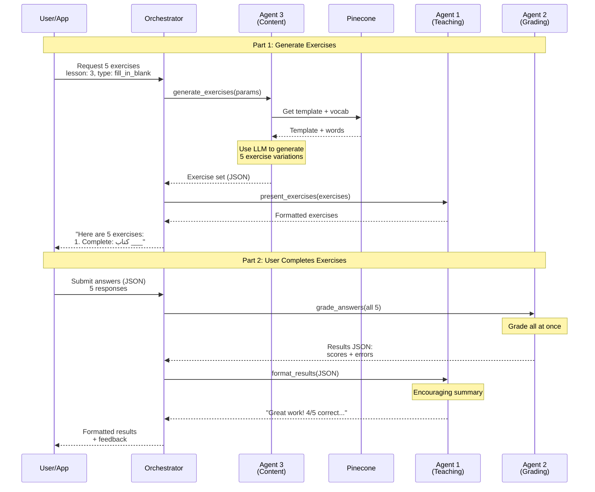

### Step-by-Step

**Part 1: Exercise Generation**

1. **User → Orchestrator:** "Give me 5 fill-in-blank exercises for Lesson 3"

2. **Agent 3:**
   - Retrieves template from RAG
   - Gets student vocabulary: `["كبير", "صغير"]`
   - Uses lightweight LLM to generate 5 variations:
   ```json
   [
     {"question": "Complete: كتاب ___", "answer": "كبير", "options": ["كبير", "كبيرة"]},
     {"question": "Complete: مدرسة ___", "answer": "كبيرة", "options": ["كبير", "كبيرة"]},
     ...
   ]
   ```

3. **Agent 1:** Presents exercises in clear format

4. **User Receives:** 5 exercises to complete

**Part 2: Grading Exercises**

5. **User → Orchestrator:** Submit all 5 answers as JSON

6. **Agent 2:** 
   - Grades all 5 at once
   - Returns results with error details for each

7. **Agent 1:**
   - Formats encouraging summary
   - "Great work! You got 4 out of 5 correct! 🌟"
   - Shows which ones were wrong with explanations

8. **User Receives:** Graded results with encouraging feedback

---

## Flow 4: Test Mode (Multiple Grammar Points)

**Scenario:** User requests end-of-lesson test for Lesson 3

### Sequence Diagram

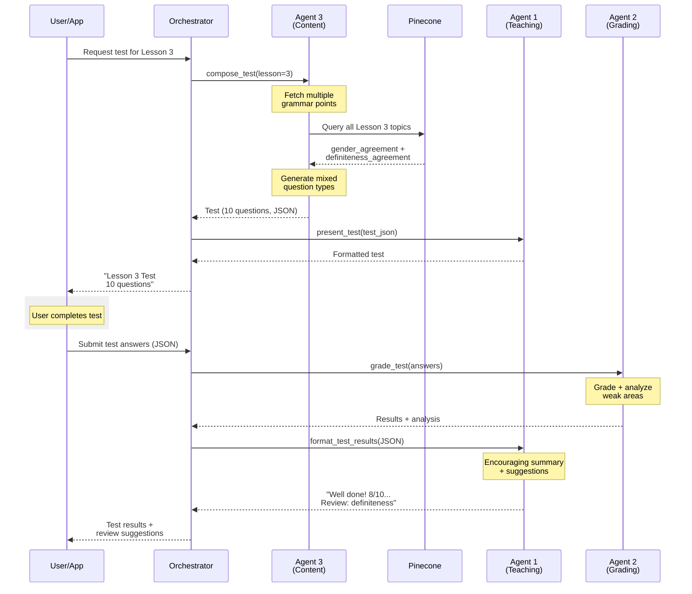

### Step-by-Step

1. **User → Orchestrator:** "Give me a test for Lesson 3"

2. **Agent 3 Test Composition:**
   - Queries RAG for all Lesson 3 grammar points
   - Finds: `gender_agreement` + `definiteness_agreement`
   - Generates 10 questions (mix of types):
     - 5 fill-in-blank
     - 3 correction exercises
     - 2 translation

3. **Agent 1 Presentation:** Formats test with instructions

4. **User Completes Test**

5. **Agent 2 Grading:**
   - Grades all 10 questions
   - Analyzes patterns (e.g., "weak on definiteness")
   - Calculates score: 8/10

6. **Agent 1 Results Formatting:**
   ```
   "Well done! You scored 8 out of 10! 🎉
   
   Strengths:
   - Excellent at gender agreement (5/5 correct)
   
   Areas to review:
   - Definiteness agreement (3/5 correct)
   
   Suggestion: Review when to use ال with adjectives.
   
   Ready to move to Lesson 4?"
   ```

7. **User Receives:** Encouraging results + targeted review suggestions

---

## Flow 5: Adding New Lesson (No Retrain)

**Scenario:** Developer adds Lesson 9 (not in training data)

### Sequence Diagram

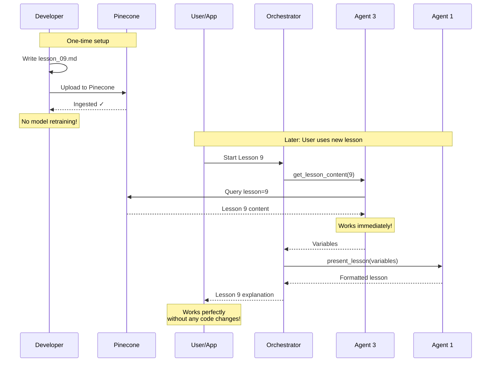

### Step-by-Step

**Setup (Developer):**

1. **Write `lesson_09.md`:**
   ```markdown
   ---
   lesson_number: 9
   grammar_point: plural_agreement
   ---
   
   # Lesson 9: Plural Forms
   
   ## Rule
   Non-human plurals are treated as feminine singular...
   ```

2. **Ingest to Pinecone:**
   ```bash
   python rag/ingest_lessons.py --lesson data/lessons/lesson_09.md
   ```

3. **Done!** No model retraining, no code changes

**Usage (User):**

4. **User starts Lesson 9** (same as any other lesson)

5. **Agent 3** retrieves from Pinecone (lesson exists now)

6. **Agent 1** formats using same templates

7. **Works immediately** - model generalizes to new grammar point

**Why This Works:**
- ✅ Grammar rules are data (RAG), not model weights
- ✅ Model learned "how to teach," not "what to teach"
- ✅ Templates work for any grammar point
- ✅ Truly scalable to 100+ lessons

---

## Error Handling Flows

### Error Case 1: RAG Returns No Results

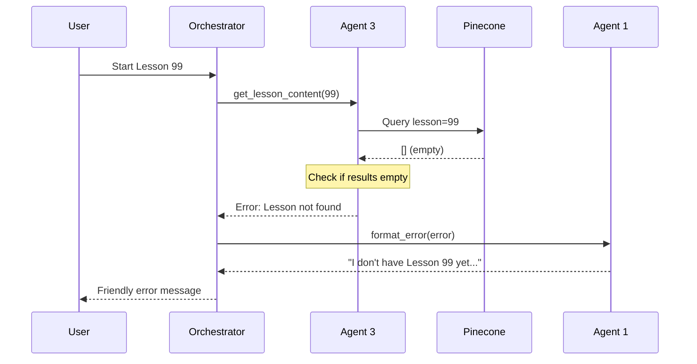

**Handling:**
- Agent 3 checks if RAG returns results
- If empty, returns error to orchestrator
- Agent 1 formats friendly message
- User sees: "I don't have Lesson 99 available yet. Would you like to try Lessons 1-8?"

---

### Error Case 2: Agent 2 Returns Invalid JSON

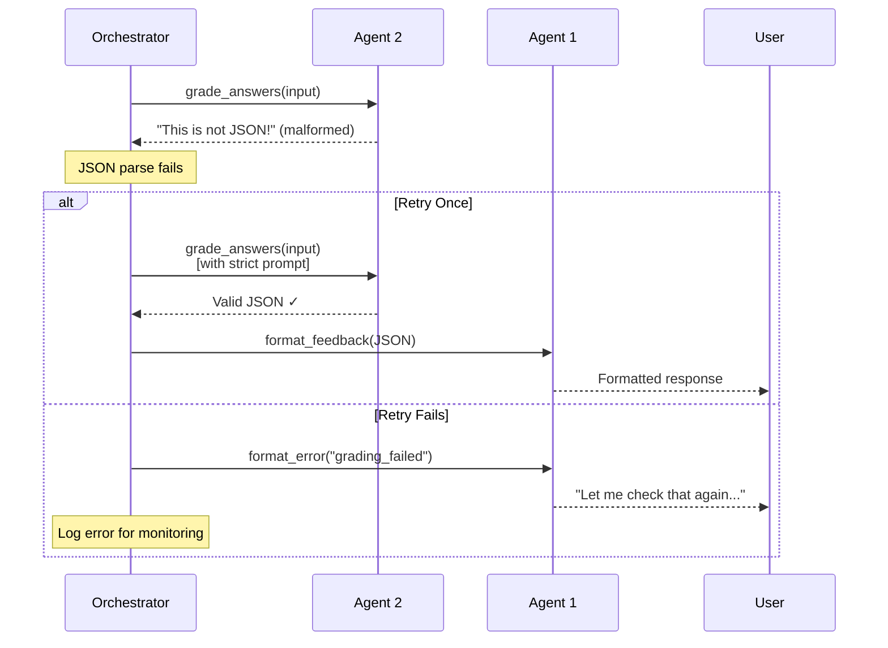

**Handling:**
- Orchestrator validates JSON from Agent 2
- If invalid, retry once with stricter prompt
- If still fails, graceful degradation
- User sees friendly message, not raw error

---

### Error Case 3: Agent 3 Generation Timeout

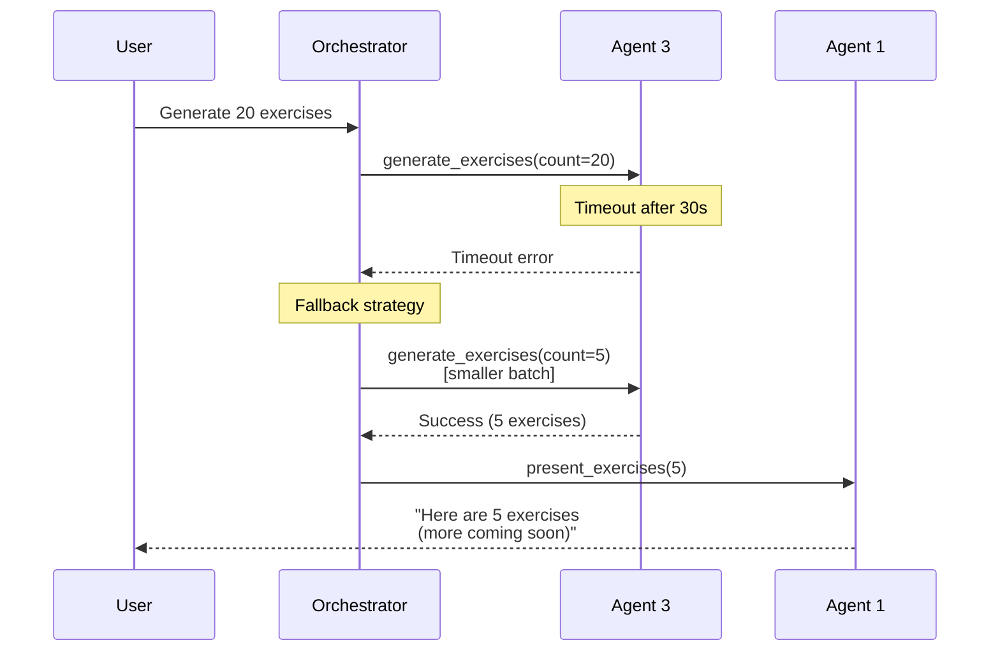

**Handling:**
- Timeouts on large requests
- Fallback to smaller batch
- Progressive delivery if needed
- User still gets something useful

---

## State Management

### Conversation State Structure

```python
class ConversationState(TypedDict):
    # Session info
    session_id: str
    lesson_number: int
    student_vocab: List[str]  # From app
    
    # Pre-loaded for performance
    pre_loaded_rules: dict  # Agent 2 cache
    
    # Context
    current_mode: str  # "teaching" | "quiz" | "exercise" | "test"
    conversation_history: List[dict]
    
    # Progress tracking
    questions_answered: int
    questions_correct: int
    weak_grammar_points: List[str]
```

### State Transitions

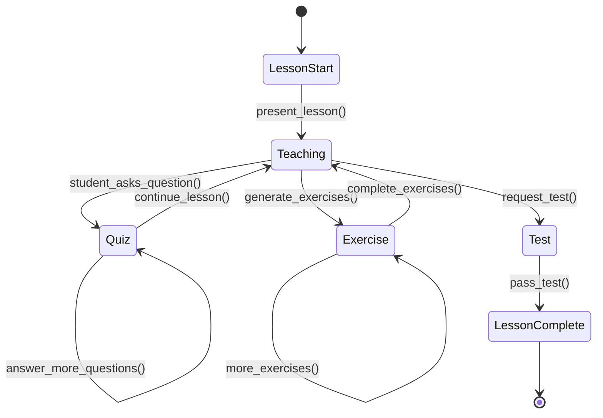

---

## Performance Considerations

### Pre-loading Strategy

**When Lesson Starts:**
```
Agent 3 retrieves:
├─ Grammar rules → Send to Agent 2 (cache)
├─ Lesson content → Send to Agent 1 (present)
└─ Exercise templates → Keep in Agent 3 (for later)
```

**Result:** Quiz questions are instant (no RAG query needed)

### Parallel Operations

**During Lesson Start:**
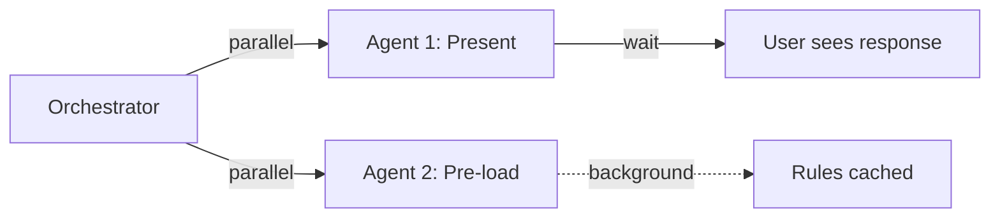

User sees teaching content immediately while Agent 2 loads in background.

---

## Summary: Flow Patterns

| Flow | Agents Used | RAG Queries | Performance |
|------|-------------|-------------|-------------|
| **Teaching** | A3 → A1 (+ A2 pre-load) | 1 query | ~1-2s |
| **Quiz** | A2 → A1 | 0 (pre-loaded) | <500ms |
| **Exercise Gen** | A3 → A1 | 1 query + LLM gen | ~2-3s |
| **Exercise Grade** | A2 → A1 | 0 (pre-loaded) | <1s |
| **Test** | A3 → A1 → A2 → A1 | 1 query | ~3-5s |
| **Add Lesson** | RAG ingest only | Upload once | N/A |

**Key Insight:** Pre-loading Agent 2 at lesson start makes quizzes lightning-fast.

---

**Next:** Review these flows and identify any edge cases or missing scenarios to add to implementation plan.
